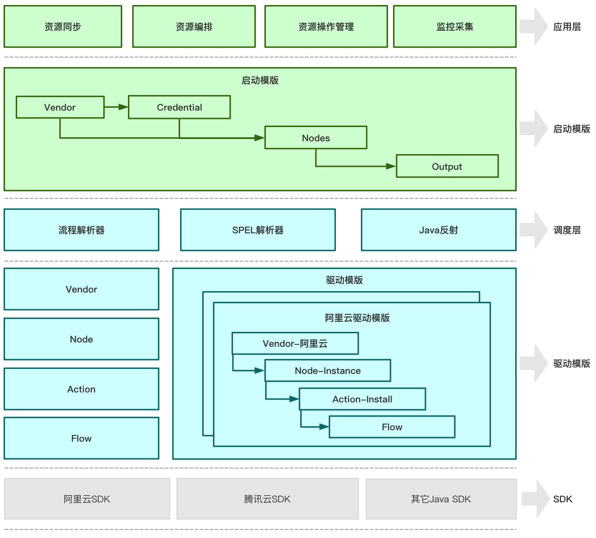

# VegaOps

<p align="center">基于API的高效调度编排工具</p>
<p align="center">
  
  
  
</p>
<p align="center">
  <a href="./README.en.md">English</a> |
  <a href="./README.md">中文</a>
</p>

## 简介

VegaOps是基于API的高效调度编排工具。VegaOps旨在提供

1. 灵活的编排采集能力: 
  - 对标OpenStack heat、terraform等，通过解析资源模版，可快速批量构建云资源；
  - 可通过资源模版，获取多云资源，提供格式化输出数据到用户CMDB；
  - 可通过metric模版，获取多云监控指标，并提供格式化输出数据到用户监控平台；
2. 灵活的Provider拓展能力: 
  - 无需编译打包，通过编写provider提供的各资源的json解析文件，实现Provider拓展；
  - 灵活生效，无需重新进行复杂的打包流程，provider的解析json保存即生效，可灵活应对云厂商接口变化；
3. 资源标准化能力（企业版）:
  - 提供provider中资源建模及资源对象继承能力。
  - 提供各类API Base产品（尤其是云产品）资源能力标准化资源接口及编排能力；

# 快速开始

## 安装VegaOps

### Linux
执行以下命令快速安装VegaOps

```
curl -L -o - https://gitee.com/openproclouder/vegaops-core/raw/master/quick_install.sh | sh
```

安装完成后，提供``vegaops``命令，通过``vegaops``进行编排体验！

### MacOS
执行以下命令快速安装VegaOps

```
curl -L -o - https://gitee.com/openproclouder/vegaops-core/raw/master/quick_install.sh | sh
```

安装完成后，提供``vegaops``命令，通过``vegaops``进行编排体验！

### Windows

- 下载VegaOps Relase包：``https://gitee.com/openproclouder/vegaops-core/attach_files/606982/download/vegaops-v0.1-rc.tar.gz``
- 解压至C:\目录下，并重命名为C:\vegaops
- 下载windows jre包：``https://gitee.com/openproclouder/vegaops-core/attach_files/606981/download/jre1.8-win-x64.tar.gz``
- 解压至C:\vegaops\目录下
- 将``C:\vegaops\bin\vegaops.cmd``注册成命令服务至path中即可通过``vegaops``进行编排体验！

## 运行样例

1. 通过``vegaops help``查看vegaops使用方法；
2. 通过``vegaops aliyun-query.yaml``查询阿里云主机，``aliyun-query.yaml``如下：

```
componentId: container_bz6rmv
vendor: aliyun
version: 1.0
nodes:
- componentId: instance-1
  action: list
  nodeType: instance
credentials:
  regionId: cn-qingdao
  secret: XXXX
  key: XXXX
```

## 样例列表

* [阿里云样例](https://github.com/vegaops/vegaops-example-aliyun)
* 云资源编排
* 多云资源采集
* 多云监控采集

# VegaOps设计

## VegaOps设计图

详细说明见[wiki](https://github.com/vegaops/vegaops-core/wiki)



## Provider 列表

* [阿里云](./vegaops-provider/vegaops-provider-aliyun)
* [腾讯云](./vegaops-provider/vegaops-provider-tencent)
* [AWS](./vegaops-provider/vegaops-provider-aws)
* [天翼云](./vegaops-provider/vegaops-provider-ctyun)


# 贡献与交流

## 特别致谢

- 感谢周国富教授（武汉大学计算机科学与技术学院）为VegaOps开源提供的宝贵建议！
- 感谢杨怿教授（湖北师范大学计算机科学与技术学院）为VegaOps开源提供的宝贵建议！
- 感谢廖文昭先生（中国电信集团云计算高级专家）为VegaOps开源提供的宝贵建议！
- 感谢李旸博士（中国地质大学计算机科学与技术学院）为VegaOps开源提供的宝贵建议！
- 感谢张永康博士生（香港科技大学计算机科学与工程系、阿里云云原生Team）为VegaOps开源提供的宝贵建议！
- 感谢张浩春总监（武汉莱博信息技术有限公司技术总监）为VegaOps开源提供的宝贵建议！

## 交流

加入微信交流群：

 

## 贡献

感谢小伙伴们的贡献！

- [黄迎兵同学](https://github.com/hyberbin)
- [向晋虎同学](https://github.com/chirsxjh)
- [付同永同学](https://github.com/CANYOUFINDIT)
- [郑俊杰同学](https://github.com/udbwcso)
- [王炜同学](https://github.com/18871199846)
- [崔哲同学](https://github.com/MarsCui)
- [李细鹏同学](https://github.com/hahaps)


# License
[Mozilla](./LICENSE)

Copyright (c) 2019-present, OneProCloud(WUHAN) Co.,Ltd

